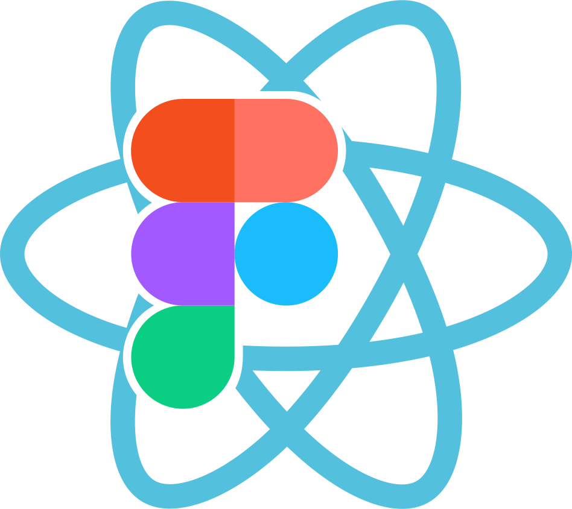

# React Figma



[](https://www.npmjs.com/package/react-figma)
[](https://circleci.com/gh/react-figma/react-figma)

A React renderer for [Figma](https://www.figma.com). Use React components as a source for your designs.

* 🍬 Compatible with [react-native](https://facebook.github.io/react-native/), [react-sketchapp](https://github.com/airbnb/react-sketchapp), [react-primitives](https://github.com/lelandrichardson/react-primitives) API.
* 🦄 Flexible layouts support with [Yoga Layout](https://yogalayout.com/).
* ♻️ Hydration and [HMR](https://webpack.js.org/concepts/hot-module-replacement/) support.
* ⚙️ Built on [Figma Plugin API](https://www.figma.com/plugin-docs/intro/).
* 🚫 **Is not a code generator**.

<p align="center"></p>

Example of code:

```javascript
import * as React from 'react';
import { Page, View, Text } from 'react-figma';

export const App = () => {
    return (
        <Page name="New page" isCurrent>
            <View>
                <View style={{ width: 200, height: 100, backgroundColor: '#dd55aa' }} />
                <Text style={{ color: '#ffffff' }}>text</Text>
            </View>
        </Page>
    );
};
```

## Installation

#### Using boilerplate

You can use [react-figma-boilerplate](https://github.com/react-figma/react-figma-boilerplate) for creating own projects.

#### From scratch

Install it with yarn:

```
yarn add react react-figma
```

Or with npm:

```
npm i react react-figma --save
```

### Usage

#### Configure main thread

```javascript
import { setupMainThread } from 'react-figma/rpc';

figma.showUI(__html__, { visible: false });

setupMainThread();
```

#### Configure ui thread

```javascript
import * as React from 'react';
import { App } from './App';

import 'react-figma/rpc';
import { render } from 'react-figma';

render(<App />);
```

#### Import components

```javascript
import * as React from 'react';
import { Page, Rectangle, Text } from 'react-figma';

export const App = () => {
    return (
        <Page name="New page">
            <Rectangle style={{ width: 200, height: 100, backgroundColor: '#dd55aa' }} />
            <Text characters="text" style={{ color: '#ffffff' }} />
        </Page>
    );
};
```

## [Docs](https://react-figma.dev/docs/API)

* [API Overview](https://react-figma.dev/docs/API)
  + [render](https://react-figma.dev/docs/api/render)
  + [Page](https://react-figma.dev/docs/api/page)
  + [Frame](https://react-figma.dev/docs/api/frame)
  + [View](https://react-figma.dev/docs/api/view)
  + [Text](https://react-figma.dev/docs/api/text)
  + [Image](https://react-figma.dev/docs/api/image)
  + ...
* [Styling](https://react-figma.dev/docs/styling)
* [Architecture](https://react-figma.dev/docs/architecture)

## Examples

* [Basic](examples/basic)
  + [Basic + HMR](examples/basic-hmr)
* [Design system](examples/design-system)
* [Interactive](examples/interactive)
* [Data fetching](examples/fetching)
* [💅 styled-components](examples/styled-components)
* [PrimerDemo](https://github.com/react-figma/PrimerDemo) - Example of multifplatform UI-kit
* [Component Variants](examples/component-variants)
* [MDX](examples/mdx)
* [Local Styles](examples/local-styles)

## Sponsoring

[Become a backer](https://opencollective.com/reactfigma#backer) and get your logo on our Readme on GitHub with a link to your site.

<a href="https://opencollective.com/reactfigma/backer/0/website" target="_blank"></a>
<a href="https://opencollective.com/reactfigma/backer/1/website" target="_blank"></a>
<a href="https://opencollective.com/reactfigma/backer/2/website" target="_blank"></a>
<a href="https://opencollective.com/reactfigma/backer/3/website" target="_blank"></a>
<a href="https://opencollective.com/reactfigma/backer/4/website" target="_blank"></a>
<a href="https://opencollective.com/reactfigma/backer/5/website" target="_blank"></a>

[Become a sponsor](https://opencollective.com/reactfigma#sponsor) and get your logo on our README on Github with a link to your site.

<a href="https://opencollective.com/reactfigma/sponsor/0/website" target="_blank"></a>
<a href="https://opencollective.com/reactfigma/sponsor/1/website" target="_blank"></a>
<a href="https://opencollective.com/reactfigma/sponsor/2/website" target="_blank"></a>
<a href="https://opencollective.com/reactfigma/sponsor/3/website" target="_blank"></a>
<a href="https://opencollective.com/reactfigma/sponsor/4/website" target="_blank"></a>
<a href="https://opencollective.com/reactfigma/sponsor/5/website" target="_blank"></a>

## Contributing

Everyone is welcome to contribute. Whether you're helping us implement features, fix bugs or improve the docs, we'd love to have you as part of the community! 

#### How to Contribute

Check out our [Contributing Guide](./contributing.md) for ideas on contributing and setup steps for getting repository up and running on your local machine.

## Acknowledgements

React Figma team wishes to thank the following invaluable contributions:

* [Lera Lesik](https://twitter.com/Lera_Lesik), for creating project logo.
* [Maksim](https://github.com/pret-a-porter), for TypeScript counseling.

## Tested with browserstack

<a href="https://www.browserstack.com/">
     
</a>     


## Contributors ✨

Thanks goes to these wonderful people ([emoji key](https://allcontributors.org/docs/en/emoji-key)):

<!-- ALL-CONTRIBUTORS-LIST:START - Do not remove or modify this section -->
<!-- prettier-ignore-start -->
<!-- markdownlint-disable -->
<table>
  <tr>
    <td align="center"><a href="https://twitter.com/ilialesik"><br /><sub><b>Ilya Lesik</b></sub></a><br /><a href="https://github.com/react-figma/react-figma/commits?author=ilyalesik" title="Code">💻</a></td>
    <td align="center"><a href="http://losyar.com"><br /><sub><b>Losev Yaroslav</b></sub></a><br /><a href="https://github.com/react-figma/react-figma/commits?author=LosYear" title="Code">💻</a></td>
    <td align="center"><a href="https://github.com/HVish"><br /><sub><b>Vishnu Singh</b></sub></a><br /><a href="https://github.com/react-figma/react-figma/commits?author=HVish" title="Code">💻</a></td>
    <td align="center"><a href="http://corrinachow.com"><br /><sub><b>corrina</b></sub></a><br /><a href="https://github.com/react-figma/react-figma/commits?author=corrinachow" title="Code">💻</a></td>
    <td align="center"><a href="http://www.zacharyquintenwitt.com"><br /><sub><b>Zachary Witt</b></sub></a><br /><a href="https://github.com/react-figma/react-figma/commits?author=zqwitt" title="Code">💻</a></td>
    <td align="center"><a href="https://github.com/theashraf"><br /><sub><b>Abdelrahman Ashraf</b></sub></a><br /><a href="https://github.com/react-figma/react-figma/commits?author=theashraf" title="Code">💻</a></td>
    <td align="center"><a href="https://seanprashad.com"><br /><sub><b>sprashad</b></sub></a><br /><a href="https://github.com/react-figma/react-figma/commits?author=SeanPrashad" title="Documentation">📖</a></td>
  </tr>
  <tr>
    <td align="center"><a href="https://github.com/wyvl"><br /><sub><b>Vivian Lee</b></sub></a><br /><a href="https://github.com/react-figma/react-figma/commits?author=wyvl" title="Code">💻</a></td>
    <td align="center"><a href="https://macintoshhelper.com"><br /><sub><b>macintoshhelper</b></sub></a><br /><a href="https://github.com/react-figma/react-figma/commits?author=macintoshhelper" title="Code">💻</a></td>
    <td align="center"><a href="https://github.com/pgrimaud"><br /><sub><b>Pierre Grimaud</b></sub></a><br /><a href="https://github.com/react-figma/react-figma/commits?author=pgrimaud" title="Documentation">📖</a></td>
    <td align="center"><a href="http://gwst.io"><br /><sub><b>Greg Westneat</b></sub></a><br /><a href="https://github.com/react-figma/react-figma/commits?author=leggomuhgreggo" title="Code">💻</a></td>
    <td align="center"><a href="https://mariusreimer.com"><br /><sub><b>Marius Reimer</b></sub></a><br /><a href="https://github.com/react-figma/react-figma/commits?author=reime005" title="Code">💻</a></td>
    <td align="center"><a href="http://szeko.com.au"><br /><sub><b>szeko</b></sub></a><br /><a href="https://github.com/react-figma/react-figma/commits?author=szeko" title="Code">💻</a></td>
    <td align="center"><a href="https://github.com/yoniholmes"><br /><sub><b>Jonathan Holmes</b></sub></a><br /><a href="https://github.com/react-figma/react-figma/commits?author=yoniholmes" title="Documentation">📖</a></td>
  </tr>
  <tr>
    <td align="center"><a href="https://michaelzheng.medium.com/"><br /><sub><b>不吃猫的鱼</b></sub></a><br /><a href="https://github.com/react-figma/react-figma/commits?author=n0ruSh" title="Code">💻</a></td>
    <td align="center"><a href="https://github.com/kant"><br /><sub><b>Darío Hereñú</b></sub></a><br /><a href="https://github.com/react-figma/react-figma/commits?author=kant" title="Documentation">📖</a></td>
  </tr>
</table>

<!-- markdownlint-restore -->
<!-- prettier-ignore-end -->

<!-- ALL-CONTRIBUTORS-LIST:END -->

This project follows the [all-contributors](https://github.com/all-contributors/all-contributors) specification. Contributions of any kind welcome!
